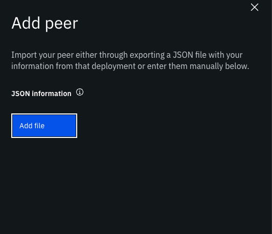

The steps to follow to add a peer to the Fabric Operations console are:
- Export peer to JSON format
- Enter the Fabric Operations Console UI
- Go to `Nodes`
- Click on `Import Ordering services`
- Select the JSON from the file system
- Click on `Add Ordering services`

## Export peer to JSON

```bash
export ORDERER_NAME=orderer0-ordmsp068wi-5vph
export ORDERER_NS=default
kubectl hlf fop export orderer --cluster-id=orderermsp1 --cluster-name="Cluster 1" --name=$ORDERER_NAME --namespace=$ORDERER_NS --out="${ORDERER_NAME}_${ORDERER_NS}.json"
```

## Enter the Fabric Operations Console UI

Open a browser and navigate to the URL you configured when creating the Fabric Operations Console.


## Go to `Nodes`

Click on `Nodes` at the sidenav to see the Peers, Certificate Authorities and Ordering Services


## Click on `Import Ordering services`

Click on `Import Ordering services` to open the dialog to import the peer.


## Select the JSON from the file system

Click on `Add file` and select the JSON file you exported from the step `Export ordering services to JSON`.



## Click on `Add Ordering services`

The last step is to click on `Add Ordering services` and the peer will be imported to the console.


