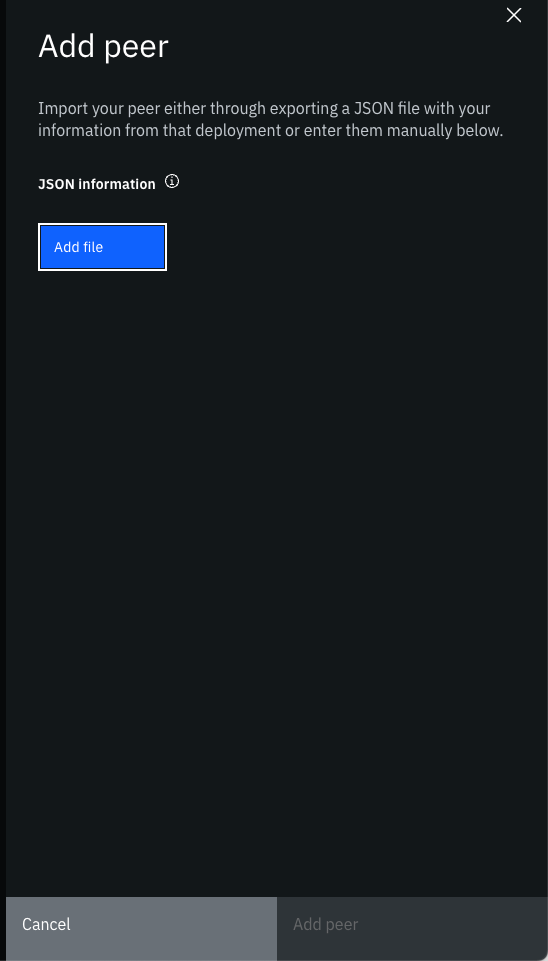

The steps to follow to add a peer to the Fabric Operations console are:
- Export peer to JSON format
- Enter the Fabric Operations Console UI
- Go to `Nodes`
- Click on `Import Peer`
- Select the JSON from the file system
- Click on `Add Peer`

## Export peer to JSON

```bash
export PEER_NAME=xxxxx
export PEER_NS=default
kubectl hlf fop export peer --name=$PEER_NAME --namespace=$PEER_NS --out="${PEER_NAME}_${PEER_NS}.json"
```

## Enter the Fabric Operations Console UI

Open a browser and navigate to the URL you configured when creating the Fabric Operations Console.


## Go to `Nodes`

Click on `Nodes` at the sidenav to see the Peers, Certificate Authorities and Ordering Services


## Click on `Import Peer`

Click on `Import Peer` to open the dialog to import the peer.


## Select the JSON from the file system

Click on `Add file` and select the JSON file you exported from the step `Export peer to JSON`.


## Click on `Add Peer`

The last step is to click on `Add Peer` and the peer will be imported to the console.




